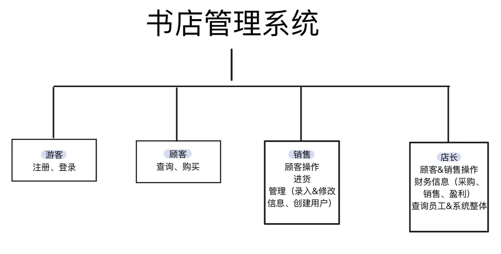
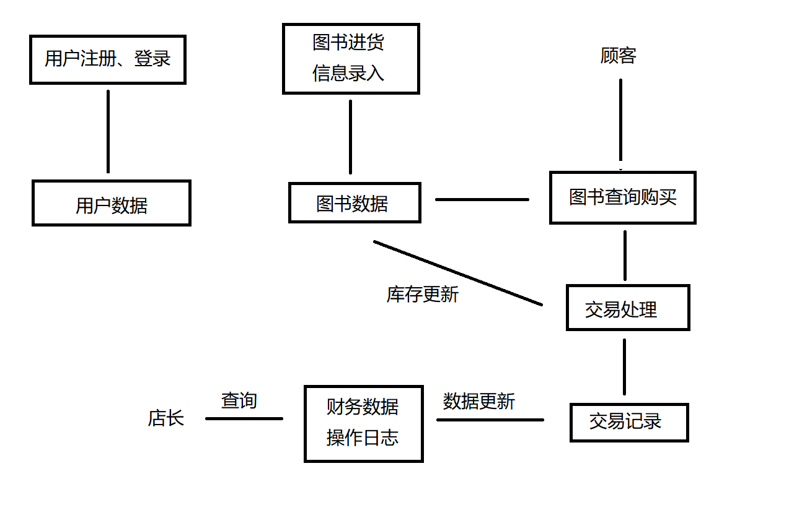

# Bookstore需求分析文档
## 一、业务流图
### 1. 整体流程

### 2. 细化流程
**图书购买流程**
```
输入ISBN和购买数量 → 检查库存 → 更新库存 → 记录交易 → 更新财务
```
**图书进货流程**
```
输入进货信息 → 检查图书是否存在 → （如不存在，录入信息）增加库存 → 记录采购 → 更新财务
```
---
## 二、数据流图

---
---
## 三、数据词典
### 用户
|      | 类型 | 长度 | 补充                     |
|------|------|----|------------------------|
| 用户ID | String | - | 每个用户的ID都唯一（不同用户ID不能重复） |
| 密码   | String | -  | -                      |
| 用户名  | String | -  | -                      |
| 权限   | Integer | -  | 游客0/顾客1/销售2/店长3        |

### 图书
|      | 类型 | 长度 | 补充        |
|------|------|------|-----------|
| ISBN | String | 20 | 每本正版书唯一标识 |
| 书名   | String | 60 | -         |
| 作者   | String | 60 | -         |
| 关键字  | String | 60 | -         |
| 单价   | Double | - | 非负数       |
| 库存   | Integer | - | -         |

### 交易记录
|       | 类型      | 长度 | 补充        |
|-------|---------|----|-----------|
| 交易ID  | Integer | -  | 每个交易ID都唯一 |
| 交易类型  | Integer | -  | 1销售/2进货   |
| ISBN  | String  | 20 | 图书ISBN    |
| 数量    | Integer | -  | -         |
| 单价    | Double  | -  | -         |
| 总价    | Double  | -  | -         |
| 操作员ID | String  | -  | -         |
| 时间    | String  | -  | -         |
---
## 四、功能说明
### （1） 用户管理
#### 1. 注册
- 输入：UserID，Password，Username
- 输出：注册成功/失败
- 权限：游客（0）
- 格式：`register [UserID] [Password] [Username]`
#### 2. 登录
- 输入：UserID，Password
- 输出：登陆成功/失败，若成功则显示权限
- 权限：所有
- 格式：`login [UserID] [Password]`
#### 3. 登出
- 输入：无
- 输出：已登出
- 权限：已登录用户
- 格式：`logout`
#### 4. 修改密码
- 输入：OldPassword，NewPassword
- 输出：修改成功/失败
- 权限：已登录用户（旧密码输入正确）
- 格式：`password [OldPassword] [NewPassword]`
#### 5. 创建用户
- 输入：UserID, Password, Privilege, Username
- 输出：创建成功/失败
- 权限：销售人员（2）、店长（3）
- 格式：`adduser [UserID] [Password] [Privilege] [Username]`
### （2）图书管理
#### 1. 查询图书
- 输入：查询条件（ISBN/书名/作者/关键字）
- 输出：图书列表（ISBN | 书名 | 作者 | 关键字 | 单价 | 库存）
- 权限：顾客（1）及以上
- 格式：
    - `show`  显示所有
    - `show ISBN=[ISBN]`
    - `show name="[书名]"`
    - `show author="[作者]"`
    - `show keyword="[关键字]"`
#### 2. 购买图书
- 输入：ISBN, Quantity
- 输出：交易总价/错误信息
- 权限：顾客（1）及以上
- 格式：`buy [ISBN] [Quantity]`
#### 3. 选择图书
- 输入：ISBN
- 输出：选择成功/失败
- 权限：销售人员（2）、店长（3）
- 格式：`select [ISBN]`
- 说明：为修改操作选定图书
#### 4. 修改图书
- 输入：修改字段（书名/作者/关键字/价格）
- 输出：修改成功/失败
- 权限：销售人员（2）、店长（3）
- 格式：`modify name="[书名]" author="[作者]" keyword="[关键字]" price="[价格]"`
- 说明：需先执行select命令
#### 5. 录入图书
- 输入：ISBN, name, author, keyword, quantity, CostPrice, price
- 输出：录入成功/失败（若该ISBN已被录入，则失败）
- 权限：销售人员（2）、店长（3）
- 格式：- 格式：`enter ISBN="[ISBN]" name="[书名]" author="[作者]" keyword="[关键字]" quantity="[进货数量]" CostPrice="[进货价]" price="[价格]"`
#### 6. 图书进货
- 输入：Quantity, ISBN, CostPrice
- 输出：进货总成本
- 权限：销售人员（2）、店长（3）
- 格式：`import [Quantity] [ISBN], cost=[CostPrice]`
- 说明：图书不存在时需先录入
### （3）财务报表
#### 1. 财务总览
- 输入：无（或时间范围）
- 输出：总收入、总支出、净利润
- 权限：店长（3）
- 格式：`show finance`
#### 2. 采购记录
- 输入：无（或时间范围）
- 输出：采购记录列表
- 权限：店长（3）
- 格式：`show finance -import`
#### 3. 销售记录
- 输入：无（或时间范围）
- 输出：销售记录列表
- 权限：店长（3）
- 格式：`show finance -sell`
#### 4. 员工报告
- 输入：UserID
- 输出：员工操作记录
- 权限：店长（3）
- 格式：`report employee [UserID]`
#### 5. 系统日志
- 输入：无（或筛选条件）
- 输出：系统操作日志
- 权限：店长（3）
- 格式：`log`
---
## 五、用户交互设计
### （1）命令格式
| 命令              | 格式                                                   | 权限      | 功能   |
|-----------------|------------------------------------------------------|---------|------|
| quit/exit       | `quit`                                               | 0,1,2,3 | 退出   |
| register        | `register [UserID] [Password] [Username]`            | 0,1,2,3 | 注册   |
| login           | `login [UserID] [Password]`                          | 0,1,2,3 | 登录   |
| logout          | `logout`                                             | 1,2,3   | 登出   |
| password        | `password [OldPassword] [NewPassword]`               | 1,2,3   | 改密码  |
| adduser         | `adduser [UserID] [Password] [Privilege] [Username]` | 2,3     | 创建用户 |
| show            | `show [查询条件]`                                        | 1,2,3   | 查询图书 |
| buy             | `buy [ISBN] [Quantity]`                              | 1,2,3   | 购买图书 |
| select          | `select [ISBN]`                                      | 2,3     | 选择图书 |
| modify          | `modify [所做修改]`                                      | 2,3     | 修改图书 |
| import          | `import [Quantity] [ISBN], cost=[CostPrice]`         | 2,3     | 进货   |
| show finance    | `show finance `                                      | 3       | 财务查询 |
| report employee | `report employee [UserID]`                           | 3       | 员工报告 |
| log             | `log`                                                | 3       | 系统日志 |
### （2）输出格式
- 成功：`[Success] 操作描述`
- 失败：`[Fail] 失败描述`
- 查询图书：`ISBN | 书名 | 作者 | 关键字 | 单价 | 库存`
- 交易：`[时间] ISBN | Quantity: [数量] | Price: [单价] | Total: [总价] | Operator: [操作人]`